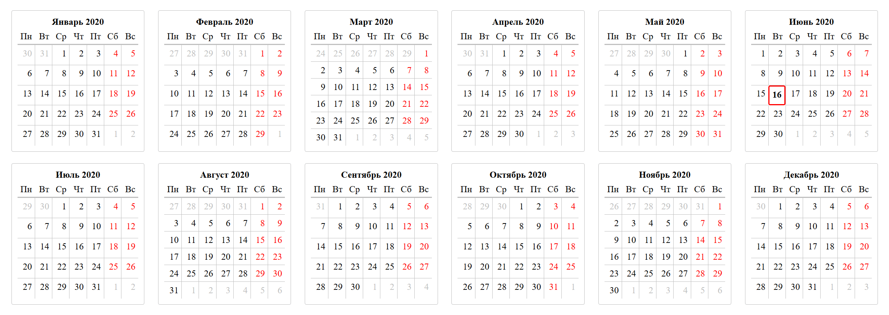

# Calendar JS



Класс Calendar. Формирует календарь на год или на месяц с версткой CSS Grid Layout.

## Содержание
<!-- MarkdownTOC levels="1,2,3,4,5,6" autoanchor="true" autolink="true" -->

- [Требования](#%D0%A2%D1%80%D0%B5%D0%B1%D0%BE%D0%B2%D0%B0%D0%BD%D0%B8%D1%8F)
- [Класс Calendar](#%D0%9A%D0%BB%D0%B0%D1%81%D1%81-calendar)
    - [Методы класса](#%D0%9C%D0%B5%D1%82%D0%BE%D0%B4%D1%8B-%D0%BA%D0%BB%D0%B0%D1%81%D1%81%D0%B0)
    - [Дополнительные параметры](#%D0%94%D0%BE%D0%BF%D0%BE%D0%BB%D0%BD%D0%B8%D1%82%D0%B5%D0%BB%D1%8C%D0%BD%D1%8B%D0%B5-%D0%BF%D0%B0%D1%80%D0%B0%D0%BC%D0%B5%D1%82%D1%80%D1%8B)
    - [HTML-представление дней календаря](#html-%D0%BF%D1%80%D0%B5%D0%B4%D1%81%D1%82%D0%B0%D0%B2%D0%BB%D0%B5%D0%BD%D0%B8%D0%B5-%D0%B4%D0%BD%D0%B5%D0%B9-%D0%BA%D0%B0%D0%BB%D0%B5%D0%BD%D0%B4%D0%B0%D1%80%D1%8F)
    - [Примеры](#%D0%9F%D1%80%D0%B8%D0%BC%D0%B5%D1%80%D1%8B)
        - [Календарь на текущий год](#%D0%9A%D0%B0%D0%BB%D0%B5%D0%BD%D0%B4%D0%B0%D1%80%D1%8C-%D0%BD%D0%B0-%D1%82%D0%B5%D0%BA%D1%83%D1%89%D0%B8%D0%B9-%D0%B3%D0%BE%D0%B4)
        - [Календарь на заданный год](#%D0%9A%D0%B0%D0%BB%D0%B5%D0%BD%D0%B4%D0%B0%D1%80%D1%8C-%D0%BD%D0%B0-%D0%B7%D0%B0%D0%B4%D0%B0%D0%BD%D0%BD%D1%8B%D0%B9-%D0%B3%D0%BE%D0%B4)
        - [Календарь на текущий месяц](#%D0%9A%D0%B0%D0%BB%D0%B5%D0%BD%D0%B4%D0%B0%D1%80%D1%8C-%D0%BD%D0%B0-%D1%82%D0%B5%D0%BA%D1%83%D1%89%D0%B8%D0%B9-%D0%BC%D0%B5%D1%81%D1%8F%D1%86)
        - [Календарь на заданный месяц](#%D0%9A%D0%B0%D0%BB%D0%B5%D0%BD%D0%B4%D0%B0%D1%80%D1%8C-%D0%BD%D0%B0-%D0%B7%D0%B0%D0%B4%D0%B0%D0%BD%D0%BD%D1%8B%D0%B9-%D0%BC%D0%B5%D1%81%D1%8F%D1%86)
        - [HTML-код страницы календаря](#html-%D0%BA%D0%BE%D0%B4-%D1%81%D1%82%D1%80%D0%B0%D0%BD%D0%B8%D1%86%D1%8B-%D0%BA%D0%B0%D0%BB%D0%B5%D0%BD%D0%B4%D0%B0%D1%80%D1%8F)
        - [HTML-код календаря на месяц](#html-%D0%BA%D0%BE%D0%B4-%D0%BA%D0%B0%D0%BB%D0%B5%D0%BD%D0%B4%D0%B0%D1%80%D1%8F-%D0%BD%D0%B0-%D0%BC%D0%B5%D1%81%D1%8F%D1%86)
- [Автор](#%D0%90%D0%B2%D1%82%D0%BE%D1%80)
- [Лицензия](#%D0%9B%D0%B8%D1%86%D0%B5%D0%BD%D0%B7%D0%B8%D1%8F)

<!-- /MarkdownTOC -->

<a id="%D0%A2%D1%80%D0%B5%D0%B1%D0%BE%D0%B2%D0%B0%D0%BD%D0%B8%D1%8F"></a>
## Требования

- [jQuery](https://jquery.com/)
- Веб-браузер, [поддерживающий](https://caniuse.com/#feat=css-grid) спецификацию [CSS Grid Layout (level 1)](https://www.w3.org/TR/css-grid-1/):
    - Google Chrome >= 57
    - Mozilla Firefox >= 52
    - Apple Safari >= 10.1
    - Microsoft Edge >= 16
    - Opera >= 68

<a id="%D0%9A%D0%BB%D0%B0%D1%81%D1%81-calendar"></a>
## Класс Calendar

<a id="%D0%9C%D0%B5%D1%82%D0%BE%D0%B4%D1%8B-%D0%BA%D0%BB%D0%B0%D1%81%D1%81%D0%B0"></a>
### Методы класса

- `construct([fullYear])` Конструктор.
    + `fullYear` - четырёхзначный номер года. Если не номер года не передан, то используется текущий год.
- `getMonthHTML([month])` Возвращает HTML представление месяца в виде обернутого набора jQuery.
    + `month` -  номер месяца. Нумерация месяцев начинается с нуля для первого месяца в году. Если не месяц не передан, то используется текущий месяц.
- `getYearHTML()` Возвращает HTML представление года в виде обернутого набора jQuery.

<a id="%D0%94%D0%BE%D0%BF%D0%BE%D0%BB%D0%BD%D0%B8%D1%82%D0%B5%D0%BB%D1%8C%D0%BD%D1%8B%D0%B5-%D0%BF%D0%B0%D1%80%D0%B0%D0%BC%D0%B5%D1%82%D1%80%D1%8B"></a>
### Дополнительные параметры

Дополнительные параметры работы устанавливаются через свойства объекта класса `Calendar`.

Свойство                | По умолчанию     | Описание
----------------------- | ---------------- | --------
`showYearTitle`         | false            | Включает отображение заголовка года
`showMonthTitle`        | true             | Включает отображение заголовка месяца
`showMonthTitleYear`    | true             | Включает отображение номера года в заголовке месяца
`showNextPrevDays`      | true             | Включает отображение дат из последующего и предыдущего месяца в текущем месяце

<a id="html-%D0%BF%D1%80%D0%B5%D0%B4%D1%81%D1%82%D0%B0%D0%B2%D0%BB%D0%B5%D0%BD%D0%B8%D0%B5-%D0%B4%D0%BD%D0%B5%D0%B9-%D0%BA%D0%B0%D0%BB%D0%B5%D0%BD%D0%B4%D0%B0%D1%80%D1%8F"></a>
### HTML-представление дней календаря

Для каждого дня месяца в HTML-коде устанавливаются следующие атрибуты `data-*`:

- `data-day` - день месяца (1-31);
- `data-month` - номер месяца (0-11). Нумерация месяцев начинается с нуля для первого месяца в году;
- `data-year` - четырёхзначный номер года;
- `data-wday` - номер дня недели (0-6). Нумерация дней недели начинается с нуля для понедельника;
- `data-iso-date` - дата в формате [ISO 8601](https://ru.wikipedia.org/wiki/ISO_8601) (2020-06-28).

Для каждого дня месяца в HTML-коде могут устанавливаться следующие классы:

- `current` - день текущего месяца;
- `previous` - день предыдущего месяца;
- `next` - день следующего месяца;
- `today` - сегодняшний день;
- `holiday` - выходной день (суббота или воскресенье).

Пример:
```html
<div data-day="6" data-month="5" data-year="2020" data-wday="6" data-iso-date="2020-06-06" class="current holiday">
      <div class="day-number">6</div>
</div>
```

<a id="%D0%9F%D1%80%D0%B8%D0%BC%D0%B5%D1%80%D1%8B"></a>
### Примеры

<a id="%D0%9A%D0%B0%D0%BB%D0%B5%D0%BD%D0%B4%D0%B0%D1%80%D1%8C-%D0%BD%D0%B0-%D1%82%D0%B5%D0%BA%D1%83%D1%89%D0%B8%D0%B9-%D0%B3%D0%BE%D0%B4"></a>
#### Календарь на текущий год

```js
$(() => {
    let calendar = new Calendar();

    // Включаем отображение заголовка года
    calendar.showYearTitle = true;

    // Выключаем отображение номера года в заголовке месяца
    calendar.showMonthTitleYear = false;

    // Выключаем отображение дат из последующего и предыдущего месяца в текущем месяце
    calendar.showNextPrevDays = false;

    // Получам календарь на текущий год
    let $year = calendar.getYearHTML();

    // Выводим календарь
    $('body').append($year);
});
```

<a id="%D0%9A%D0%B0%D0%BB%D0%B5%D0%BD%D0%B4%D0%B0%D1%80%D1%8C-%D0%BD%D0%B0-%D0%B7%D0%B0%D0%B4%D0%B0%D0%BD%D0%BD%D1%8B%D0%B9-%D0%B3%D0%BE%D0%B4"></a>
#### Календарь на заданный год

```js
$(() => {
    let calendar = new Calendar(2020);

    // Получам календарь на 2020 год
    let $year = calendar.getYearHTML();

    // Выводим календарь
    $('body').append($year);
});
```

<a id="%D0%9A%D0%B0%D0%BB%D0%B5%D0%BD%D0%B4%D0%B0%D1%80%D1%8C-%D0%BD%D0%B0-%D1%82%D0%B5%D0%BA%D1%83%D1%89%D0%B8%D0%B9-%D0%BC%D0%B5%D1%81%D1%8F%D1%86"></a>
#### Календарь на текущий месяц

```js
$(() => {
    let calendar = new Calendar();

    // Получам календарь на текущий месяц текущего года
    let $month = calendar.getMonthHTML();

    // Выводим календарь
    $('body').append($month);
});
```

<a id="%D0%9A%D0%B0%D0%BB%D0%B5%D0%BD%D0%B4%D0%B0%D1%80%D1%8C-%D0%BD%D0%B0-%D0%B7%D0%B0%D0%B4%D0%B0%D0%BD%D0%BD%D1%8B%D0%B9-%D0%BC%D0%B5%D1%81%D1%8F%D1%86"></a>
#### Календарь на заданный месяц

```js
$(() => {
    let calendar = new Calendar(2020);

    // Получам календарь на июнь месяц 2020-го года
    let $month = calendar.getMonthHTML(5);

    // Выводим календарь
    $('body').append($month);
});
```

<a id="html-%D0%BA%D0%BE%D0%B4-%D1%81%D1%82%D1%80%D0%B0%D0%BD%D0%B8%D1%86%D1%8B-%D0%BA%D0%B0%D0%BB%D0%B5%D0%BD%D0%B4%D0%B0%D1%80%D1%8F"></a>
#### HTML-код страницы календаря

```html
<!doctype html>
<html lang="ru">
  <head>
    <meta charset="utf-8">
    <meta name="viewport" content="width=device-width, initial-scale=1">
    <title>Calendar example</title>

    <link rel="stylesheet" href="../src/calendar.css">    

    <script src="https://code.jquery.com/jquery-3.3.1.min.js"></script>
    <script src="../src/calendar.js"></script>

    <script>
      $(() => {
        let calendar = new Calendar(),
            $year = calendar.getYearHTML(),
            $month = calendar.getMonthHTML();
        $('body').append($year, $month);
      });
    </script>

  </head>
  <body>
  </body>
</html>
```

<a id="html-%D0%BA%D0%BE%D0%B4-%D0%BA%D0%B0%D0%BB%D0%B5%D0%BD%D0%B4%D0%B0%D1%80%D1%8F-%D0%BD%D0%B0-%D0%BC%D0%B5%D1%81%D1%8F%D1%86"></a>
#### HTML-код календаря на месяц

```html
<div class="neuro-calendar-month-wrapper">
  <div class="neuro-calendar-month-title">Июнь 2020</div>
  <div class="neuro-calendar-month">
    <div class="wday">Пн</div>
    <div class="wday">Вт</div>
    <div class="wday">Ср</div>
    <div class="wday">Чт</div>
    <div class="wday">Пт</div>
    <div class="wday">Сб</div>
    <div class="wday">Вс</div>
    <div data-day="1" data-month="5" data-year="2020" data-wday="1" data-iso-date="2020-06-01" class="current">
      <div class="day-number">1</div>
    </div>
    <div data-day="2" data-month="5" data-year="2020" data-wday="2" data-iso-date="2020-06-02" class="current">
      <div class="day-number">2</div>
    </div>
    <div data-day="3" data-month="5" data-year="2020" data-wday="3" data-iso-date="2020-06-03" class="current">
      <div class="day-number">3</div>
    </div>
    <div data-day="4" data-month="5" data-year="2020" data-wday="4" data-iso-date="2020-06-04" class="current">
      <div class="day-number">4</div>
    </div>
    <div data-day="5" data-month="5" data-year="2020" data-wday="5" data-iso-date="2020-06-05" class="current">
      <div class="day-number">5</div>
    </div>
    <div data-day="6" data-month="5" data-year="2020" data-wday="6" data-iso-date="2020-06-06" class="current holiday">
      <div class="day-number">6</div>
    </div>
    <div data-day="7" data-month="5" data-year="2020" data-wday="0" data-iso-date="2020-06-07" class="current holiday">
      <div class="day-number">7</div>
    </div>
    <div data-day="8" data-month="5" data-year="2020" data-wday="1" data-iso-date="2020-06-08" class="current">
      <div class="day-number">8</div>
    </div>
    <div data-day="9" data-month="5" data-year="2020" data-wday="2" data-iso-date="2020-06-09" class="current">
      <div class="day-number">9</div>
    </div>
    <div data-day="10" data-month="5" data-year="2020" data-wday="3" data-iso-date="2020-06-10" class="current">
      <div class="day-number">10</div>
    </div>
    <div data-day="11" data-month="5" data-year="2020" data-wday="4" data-iso-date="2020-06-11" class="current">
      <div class="day-number">11</div>
    </div>
    <div data-day="12" data-month="5" data-year="2020" data-wday="5" data-iso-date="2020-06-12" class="current">
      <div class="day-number">12</div>
    </div>
    <div data-day="13" data-month="5" data-year="2020" data-wday="6" data-iso-date="2020-06-13" class="current holiday">
      <div class="day-number">13</div>
    </div>
    <div data-day="14" data-month="5" data-year="2020" data-wday="0" data-iso-date="2020-06-14" class="current holiday">
      <div class="day-number">14</div>
    </div>
    <div data-day="15" data-month="5" data-year="2020" data-wday="1" data-iso-date="2020-06-15" class="current">
      <div class="day-number">15</div>
    </div>
    <div data-day="16" data-month="5" data-year="2020" data-wday="2" data-iso-date="2020-06-16" class="current today">
      <div class="day-number">16</div>
    </div>
    <div data-day="17" data-month="5" data-year="2020" data-wday="3" data-iso-date="2020-06-17" class="current">
      <div class="day-number">17</div>
    </div>
    <div data-day="18" data-month="5" data-year="2020" data-wday="4" data-iso-date="2020-06-18" class="current">
      <div class="day-number">18</div>
    </div>
    <div data-day="19" data-month="5" data-year="2020" data-wday="5" data-iso-date="2020-06-19" class="current">
      <div class="day-number">19</div>
    </div>
    <div data-day="20" data-month="5" data-year="2020" data-wday="6" data-iso-date="2020-06-20" class="current holiday">
      <div class="day-number">20</div>
    </div>
    <div data-day="21" data-month="5" data-year="2020" data-wday="0" data-iso-date="2020-06-21" class="current holiday">
      <div class="day-number">21</div>
    </div>
    <div data-day="22" data-month="5" data-year="2020" data-wday="1" data-iso-date="2020-06-22" class="current">
      <div class="day-number">22</div>
    </div>
    <div data-day="23" data-month="5" data-year="2020" data-wday="2" data-iso-date="2020-06-23" class="current">
      <div class="day-number">23</div>
    </div>
    <div data-day="24" data-month="5" data-year="2020" data-wday="3" data-iso-date="2020-06-24" class="current">
      <div class="day-number">24</div>
    </div>
    <div data-day="25" data-month="5" data-year="2020" data-wday="4" data-iso-date="2020-06-25" class="current">
      <div class="day-number">25</div>
    </div>
    <div data-day="26" data-month="5" data-year="2020" data-wday="5" data-iso-date="2020-06-26" class="current">
      <div class="day-number">26</div>
    </div>
    <div data-day="27" data-month="5" data-year="2020" data-wday="6" data-iso-date="2020-06-27" class="current holiday">
      <div class="day-number">27</div>
    </div>
    <div data-day="28" data-month="5" data-year="2020" data-wday="0" data-iso-date="2020-06-28" class="current holiday">
      <div class="day-number">28</div>
    </div>
    <div data-day="29" data-month="5" data-year="2020" data-wday="1" data-iso-date="2020-06-29" class="current">
      <div class="day-number">29</div>
    </div>
    <div data-day="30" data-month="5" data-year="2020" data-wday="2" data-iso-date="2020-06-30" class="current">
      <div class="day-number">30</div>
    </div>
    <div class="next" data-day="1" data-month="6" data-year="2020" data-wday="3" data-iso-date="2020-07-01">
      <div class="day-number">1</div>
    </div>
    <div class="next" data-day="2" data-month="6" data-year="2020" data-wday="4" data-iso-date="2020-07-02">
      <div class="day-number">2</div>
    </div>
    <div class="next" data-day="3" data-month="6" data-year="2020" data-wday="5" data-iso-date="2020-07-03">
      <div class="day-number">3</div>
    </div>
    <div class="next holiday" data-day="4" data-month="6" data-year="2020" data-wday="6" data-iso-date="2020-07-04">
      <div class="day-number">4</div>
    </div>
    <div class="next holiday" data-day="5" data-month="6" data-year="2020" data-wday="0" data-iso-date="2020-07-05">
      <div class="day-number">5</div>
    </div>
  </div>
</div>
```

<a id="%D0%90%D0%B2%D1%82%D0%BE%D1%80"></a>
## Автор

© 2019-2020 andrey-tech

<a id="%D0%9B%D0%B8%D1%86%D0%B5%D0%BD%D0%B7%D0%B8%D1%8F"></a>
## Лицензия

Данный класс распространяется на условиях лицензии [MIT](./LICENSE).

